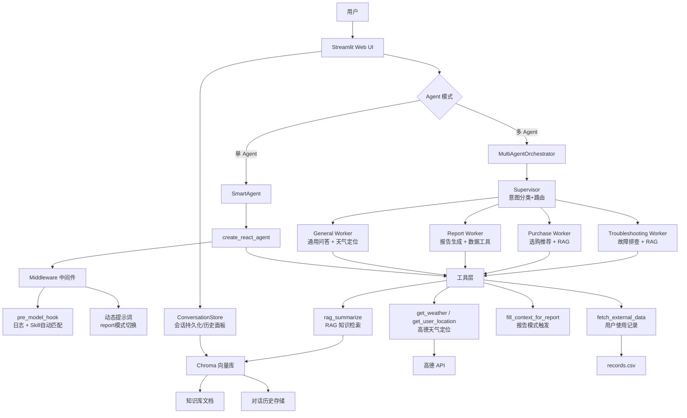

# 🤖 智扫通 — 扫地机器人智能客服

> demo来源黑马程序员

基于 **RAG + ReAct Agent + Multi-Agent 协作** 架构的扫地/扫拖一体机器人智能客服系统。使用通义千问（DashScope）作为底层模型，结合 Chroma 向量知识库、工具调用与 Skill 模板，支持**单 Agent / 多 Agent 协作两种模式**一键切换，为用户提供产品咨询、故障排查、选购推荐、使用报告生成等服务。

## ✨ 核心特性

- **多 Agent 协作**：Supervisor-Worker 架构，自动识别用户意图并路由到 4 个专业 Agent（故障排查/选购推荐/报告生成/通用问答），每 Worker 独立工具集
- **单 Agent 模式**：传统 ReAct Agent，统一管理全部工具与 Skill，适合简单问答
- **RAG 混合检索**：BM25 关键词 + 向量语义 + RRF 融合，兼顾精确匹配与语义理解，从专业知识库中精准检索并生成回答
- **Skill 自动匹配**：关键词匹配，4 个技能模板（故障排查、选购指南、配件推荐、报告生成）
- **MCP 工具扩展**：通过 MCP 协议接入高德地图（IP 定位 + 天气查询）
- **对话持久化**：基于 Chroma 的会话存储，支持软删除、多用户 token 隔离、历史会话浏览与切换
- **多轮上下文**：Agent 感知完整对话历史，追问时不再"失忆"
- **使用报告生成**：多步骤工具链（获取 ID → 月份 → 使用记录），生成结构化月度报告
- **中间件系统**：`pre_model_hook` 日志 + 自动 Skill 匹配、动态提示词切换、工具调用次数限制
- **流式输出**：Streamlit 流式输出，仅展示最终回答，隐藏中间思考过程
- **Docker 部署**：完整的 Docker 容器化支持

## 🏗️ 系统架构



## 🧠 Agent 模式

侧边栏支持两种模式一键切换：

### 单 Agent 模式（默认）

一个 Agent 管理所有工具与 Skill，适合简单问答。基于 LangGraph `create_react_agent`，自动判断并调用合适的工具。

### 多 Agent 协作模式（Supervisor-Worker）

| Worker | 职责 | 专属工具 |
|--------|------|---------|
| `troubleshooting` | 故障排查专家 | RAG 检索 |
| `purchase` | 选购顾问 | RAG 检索 |
| `report` | 报告生成专家 | 用户ID、月份、使用记录、报告触发 |
| `general` | 通用助手 | RAG 检索、天气、定位、用户ID |

Supervisor 通过 LLM 意图分类自动路由到对应 Worker，Worker 独立执行 ReAct 推理，互不干扰。

## 💬 对话持久化

基于 Chroma 的会话存储系统：

| 功能 | 说明 |
|------|------|
| **自动保存** | 每轮对话增量写入 Chroma，刷新/重启不丢失 |
| **软删除** | 删除会话仅标记 `deleted=True`，数据可恢复 |
| **多用户隔离** | 每个浏览器 Tab 生成唯一 `user_token`，对话互不可见 |
| **历史面板** | 侧边栏可浏览、切换、删除历史会话 |
| **多轮上下文** | Agent 感知完整对话历史，追问更智能 |

### 存储结构

历史对话存储在 `chroma_db/` 的 `conversation_history` collection 中，与知识库 `agent` collection 互不干扰。每条消息包含 metadata：`session_id`、`user_token`、`role`、`index`、`timestamp`、`deleted`。

## 🚀 快速开始

### 环境要求

- Python >= 3.11
- [uv](https://docs.astral.sh/uv/) 包管理器
- [DashScope API Key](https://dashscope.aliyun.com/)（通义千问）
- [高德地图 API Key](https://lbs.amap.com/)（可选，天气/定位）

### 本地运行

```bash
# 1. 克隆项目
git clone https://github.com/ShudiZhang/smart-sweeper-agent.git
cd smart_sweeper_agent

# 2. 安装依赖
uv sync

# 3. 配置环境变量
cp .env.example .env
# 编辑 .env，填入 DASHSCOPE_API_KEY

# 4. 启动应用
uv run streamlit run app.py
```

浏览器访问 `http://localhost:8501`。

### 安装 MCP 支持（可选）

```bash
uv sync --extra mcp
```

### Docker 部署

```bash
# 构建并启动
docker compose up -d

# 查看日志
docker compose logs -f

# 停止
docker compose down
```

### 环境变量

| 变量名 | 必填 | 说明 |
|--------|------|------|
| `DASHSCOPE_API_KEY` | ✅ | 阿里云 DashScope API Key |
| `AMAP_API_KEY` | ❌ | 高德地图 API Key（天气/定位功能需要） |
| `LANGCHAIN_API_KEY` | ❌ | LangSmith API Key（调试追踪） |

## 🔧 可用工具

Agent 内置以下工具，会自动根据用户问题选择合适的工具调用：

| 工具名 | 功能 | 入参 |
|--------|------|------|
| `rag_summarize` | 混合检索（BM25+向量+RRF）知识库并总结 | `query: str` |
| `get_weather` | 查询指定城市实时天气 | `city: str` |
| `get_user_location` | IP 定位获取用户城市 | 无 |
| `get_user_id` | 获取当前用户 ID | 无 |
| `get_current_month` | 获取当前日期 | 无 |
| `fetch_external_data` | 获取用户使用记录 | `user_id`, `month` |
| `fill_context_for_report` | 触发报告场景上下文 | 无 |
| `amap_ip_location` | MCP：高德 IP 定位 | 无 |
| `amap_weather` | MCP：高德天气查询 | `city: str` |

## 🎯 Skill 模板

4 个 Skill 通过 YAML frontmatter 关键词自动匹配，也可在 Streamlit 侧边栏手动选择：

| Skill | 触发关键词 | 功能 |
|-------|-----------|------|
| `troubleshooting` | 坏了、故障、异响、不工作… | 故障诊断与排查 |
| `purchase_guide` | 推荐、选购、性价比、哪个好… | 选购建议与对比 |
| `accessory_recommend` | 配件、耗材、滤芯、边刷… | 配件更换推荐 |
| `report_generation` | 报告、使用记录、统计… | 生成月度使用报告 |

自定义 Skill 只需在 `skills/` 目录下添加 `.md` 文件，含 YAML frontmatter：

```yaml
---
name: my_skill
description: 我的自定义技能
triggers:
  keywords: ["关键词1", "关键词2"]
  priority: 8
---
# 技能正文...
```

## 🧪 测试与评估

三种测评模式，覆盖不同维度：

```bash
# 快速模式 — Skill 匹配准确率（不调 LLM，零成本）
uv run python tests/run_eval.py --quick

# 完整模式 — Skill + 工具调用（调 LLM）
uv run python tests/run_eval.py --full --limit 5

# RAG 质量评估 — Faithfulness + Relevancy + Precision（LLM-as-Judge）
uv run python tests/run_eval.py --rag

# 单条测试
uv run python tests/run_eval.py --rag --id eval_001

# 全功能验证
uv run python verify_all.py

# 单元测试
uv run pytest tests/
```

## 🛡️ 安全护栏（Guardrails）

三级防护体系，覆盖所有入口（Streamlit / FastAPI / RAG 管线）：

| 层级 | 检测内容 | 动作 |
|------|---------|------|
| **输入护栏** | Prompt 注入（中英文 13 种正则模式） | 🚫 BLOCK |
| | 系统提示词泄露/角色劫持/DAN 越狱 | 🚫 BLOCK |
| | 敏感话题（上下文感知，不误伤设备问题） | 🚫 BLOCK |
| | 空输入/超长输入（>2000字符） | 🚫 BLOCK |
| **输出护栏** | 空回答/异常短回答 | 🚫 BLOCK |
| | 事实一致性校验（LLM 对比 RAG 上下文打分） | ⚠️ WARN + 免责声明 |

测试：

```bash
uv run python utils/guardrails.py
```

## 🚀 FastAPI 服务化

生产级 REST API，将 Agent 能力封装为 HTTP 服务：

| 端点 | 方法 | 功能 |
|------|------|------|
| `/` | GET | 重定向到 Swagger 文档 |
| `/health` | GET | 健康检查 |
| `/chat` | POST | 非流式对话 |
| `/chat/stream` | POST | SSE 流式对话 |
| `/sessions` | GET | 历史会话列表 |
| `/sessions/{id}` | GET | 会话详情 |
| `/sessions/{id}` | DELETE | 软删除会话 |

```bash
# 启动
uv run uvicorn server:app --host 0.0.0.0 --port 8000 --reload

# 交互式文档
open http://localhost:8000/docs

# curl 测试
curl -X POST http://localhost:8000/chat \
  -H "Content-Type: application/json" \
  -d '{"query":"小户型推荐哪款","mode":"multi"}'
```

## 🔬 RAG 混合检索管线

```
用户问题
  → InputGuard（注入检测/越狱拦截）
  → Query Rewriting（LLM 改写：补充同义词/产品术语）
  → 混合检索：
       ├─ BM25 关键词召回（稀疏，精确匹配型号/专有名词）
       ├─ 向量语义召回（稠密，理解同义改写/上下文）
       └─ RRF 融合去重（Reciprocal Rank Fusion，k=60）
  → LLM Rerank（打分 0-3 分，精选 Top-K）
  → LLM 总结回答
  → OutputGuard（事实一致性校验）
```

BM25（稀疏检索）擅长型号、错误码等精确关键词匹配；向量（稠密检索）擅长理解"机器人不动了"≈"设备停机"等语义改写。RRF 融合两者优势，同一文档被双方命中时排名自动提升。

| 组件 | 文件 | 作用 |
|------|------|------|
| Query Rewriter | `rag/query_rewriter.py` | LLM 将口语化问题改写为检索友好查询，补充同义词/产品术语 |
| Hybrid Retriever | `rag/hybrid_retriever.py` | BM25 关键词 + 向量语义双路召回，RRF 融合去重 |
| LLM Reranker | `rag/reranker.py` | LLM 对候选文档打分（0-3分），精选最相关 Top-K |
| RAG Service | `rag/rag_service.py` | 集成完整管线：安检 → Rewrite → 混合检索 → Rerank → 总结 → 事实校验 |

## 📁 项目结构详解

```
smart_sweeper_agent/
│
├── app.py                       # 🖥️ Streamlit 入口：单/多Agent切换，对话持久化，护栏
├── server.py                    # 🌐 FastAPI 服务：REST API + Swagger 文档
│
├── agent/                       # 🤖 Agent 层
│   ├── smart_agent.py           #   单Agent模式：LangGraph create_react_agent
│   ├── react_agent.py           #   ReactAgent：纯内置工具版（无Skill/MCP）
│   ├── multi_agent.py           #   多Agent协作：Supervisor-Worker架构（4个专业Worker）
│   ├── middleware.py             #   中间件：pre_model_hook、动态Prompt、工具收敛策略
│   └── tools/
│       └── agent_tools.py       #   7个内置工具：RAG检索、天气、定位、用户数据、报告生成
│
├── rag/                         # 📚 RAG 检索增强层
│   ├── rag_service.py           #   RAG总结服务：安检→Rewrite→混合检索→Rerank→总结
│   ├── vector_store.py          #   Chroma向量库：文档加载、分片、MD5去重、增量入库
│   ├── hybrid_retriever.py      #   混合检索器：BM25关键词+向量语义 → RRF融合去重
│   ├── query_rewriter.py        #   Query改写：LLM将口语查询转为检索友好格式
│   └── reranker.py              #   LLM重排序：候选文档打分精选Top-K
│
├── model/
│   └── factory.py               # 🧠 模型工厂：DashScope对话/嵌入模型懒加载单例
│
├── utils/                       # 🔧 工具层
│   ├── guardrails.py            #   安全护栏：输入注入检测 + 输出事实校验（中英文）
│   ├── conversation_store.py    #   对话持久化：Chroma存储、软删除、用户隔离、历史管理
│   ├── skill_loader.py          #   Skill加载器：YAML frontmatter解析、关键词自动匹配
│   ├── prompt_loader.py         #   提示词加载：从文件加载System/RAG/Report三种Prompt
│   ├── config_handler.py        #   配置管理：Pydantic类型安全配置（Chroma/RAG/Agent）
│   ├── amap_client.py           #   高德API客户端：IP定位 + 天气查询（tenacity重试）
│   ├── file_handler.py          #   文件处理：TXT/PDF加载、MD5校验
│   ├── path_tool.py             #   路径工具：项目根目录绝对路径解析
│   ├── logger_handler.py        #   日志处理
│   └── tracing.py               #   LangSmith追踪：自动捕获Agent调用链
│
├── mcp_servers/
│   └── amap_server.py           # 🔌 MCP Server：高德地图IP定位 + 天气查询工具
│
├── tests/                       # 🧪 测试与评估
│   ├── eval_metrics.py          #   LLM-as-Judge评估器：Faithfulness/Relevancy/Precision
│   ├── run_eval.py              #   多模式测评：--quick(零成本) --full(工具调用) --rag(质量)
│   ├── eval_dataset.yml         #   测评数据集：20条用例含期望Skill/工具/参考答案
│   ├── test_rag_quality.py      #   RAG效果独立测试：逐步骤展示检索管线
│   ├── test_rag_integration.py  #   RAG集成测试
│   └── conftest.py              #   pytest配置
│
├── data/                        # 📊 知识库
│   ├── 扫地机器人100问2.txt      #   通用FAQ
│   ├── 扫拖一体机器人100问.txt   #   扫拖一体FAQ
│   ├── 故障排除.txt              #   故障排查知识
│   ├── 维护保养.txt              #   维护保养知识
│   ├── 选购指南.txt              #   选购指南知识
│   └── external/records.csv     #   用户月度使用记录
│
├── config/                      # ⚙️ 配置文件
│   ├── chroma.yml               #   Chroma：collection名、分片参数、检索K值
│   ├── rag.yml                  #   RAG模型：chat模型名、embedding模型名
│   ├── agent.yml                #   Agent参数
│   └── prompts.yml              #   提示词路径
│
├── prompts/                     # 📝 提示词模板
│   ├── main_prompt.txt          #   主System Prompt
│   ├── rag_summarize.txt        #   RAG总结Prompt
│   └── report_prompt.txt        #   报告生成专用Prompt
│
├── skills/                      # 🎯 Skill模板
│   ├── troubleshooting.md       #   故障排查（YAML frontmatter + 关键词触发）
│   ├── purchase_guide.md        #   选购指南
│   ├── accessory_recommend.md   #   配件推荐
│   └── report_generation.md     #   报告生成
│
└── chroma_db/                   # 💾 Chroma持久化目录
    ├── agent/                   #   知识库collection（embedding + metadata）
    └── conversation_history/    #   对话历史collection（embedding + metadata）
```

## 📄 License

MIT License
