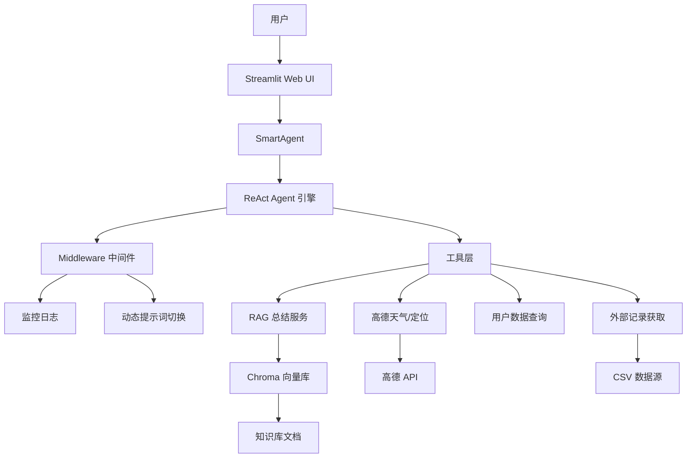

# 🤖 智扫通 — 扫地机器人智能客服

注：demo来自黑马程序员
基于 **RAG + ReAct Agent** 架构的扫地/扫拖一体机器人智能客服系统。结合向量知识库检索、大模型推理与工具调用，为用户提供专业的产品咨询、故障排查、使用报告生成等服务。

## ✨ 核心特性

- **RAG 知识库问答**：基于 Chroma 向量数据库，从专业知识库（选购指南、故障排除、维护保养等）中精准检索并生成回答
- **ReAct 智能 Agent**：具备"思考→行动→观察→再思考"的自主推理能力，自动判断是否需要调用工具
- **Skill 模板系统**：支持加载领域专用技能模板（故障排除、报告生成），动态注入 Agent 上下文
- **MCP 工具扩展**：支持通过 MCP 协议接入高德地图（IP 定位 + 天气查询）等外部工具
- **个人使用报告**：自动获取用户数据，生成结构化的机器人使用报告与保养建议
- **中间件机制**：工具调用监控、模型日志、报告场景动态提示词切换
- **Docker 部署**：完整的 Docker 容器化支持，含健康检查与数据持久化

## 🏗️ 系统架构



## 📁 项目结构

```
smart_sweeper_agent/
├── app.py                      # Streamlit 入口
├── Dockerfile                  # 容器构建
├── docker-compose.yml          # 容器编排
├── pyproject.toml              # 项目依赖与配置
├── .env                        # 环境变量（API Keys）
├── agent/
│   ├── smart_agent.py          # SmartAgent 主类（MCP + Skill + 内置工具）
│   ├── react_agent.py          # ReactAgent（纯内置工具版）
│   ├── middleware.py           # 中间件：监控、日志、提示词切换
│   └── tools/
│       └── agent_tools.py      # Agent 工具集定义
├── config/
│   ├── agent.yml               # Agent 配置
│   ├── chroma.yml              # Chroma 向量库配置
│   ├── prompts.yml             # 提示词路径配置
│   └── rag.yml                 # RAG 模型配置
├── data/                       # 知识库数据
│   ├── 扫地机器人100问2.txt
│   ├── 扫拖一体机器人100问.txt
│   ├── 故障排除.txt
│   ├── 维护保养.txt
│   ├── 选购指南.txt
│   └── external/
│       └── records.csv         # 用户使用记录
├── mcp_servers/
│   └── amap_server.py          # 高德地图 MCP Server
├── model/
│   └── factory.py              # 模型工厂（DashScope 对话/嵌入）
├── prompts/
│   ├── main_prompt.txt         # 主系统提示词
│   ├── rag_summarize.txt       # RAG 总结提示词
│   └── report_prompt.txt       # 报告生成提示词
├── rag/
│   ├── rag_service.py          # RAG 总结服务
│   └── vector_store.py         # Chroma 向量库服务
├── skills/
│   ├── report_generation.md    # 报告生成技能模板
│   └── troubleshooting.md      # 故障排除技能模板
├── utils/
│   ├── amap_client.py          # 高德 API 客户端
│   ├── config_handler.py       # 配置管理（Pydantic）
│   ├── file_handler.py         # 文件处理（TXT/PDF）
│   ├── logger_handler.py       # 日志处理
│   ├── path_tool.py            # 路径工具
│   ├── prompt_loader.py        # 提示词加载器
│   ├── skill_loader.py         # Skill 加载器
│   └── tracing.py              # LangSmith 追踪
└── tests/                      # 单元测试
```

## 🚀 快速开始

### 环境要求

- Python >= 3.11
- [DashScope API Key](https://dashscope.aliyun.com/)（通义千问模型）
- [高德地图 API Key](https://lbs.amap.com/)（可选，用于天气/定位）

### 本地运行

```bash
# 1. 克隆项目
git clone <your-repo-url>
cd smart_sweeper_agent

# 2. 同步依赖（uv 自动创建虚拟环境并安装）
uv sync

# 3. 配置环境变量
cp .env.example .env  # 编辑 .env 填入 API Keys

# 4. 启动应用
uv run streamlit run app.py
```

浏览器访问 `http://localhost:8501` 即可使用。

### Docker 部署

```bash
# 构建并启动
docker compose up -d

# 查看日志
docker compose logs -f

# 停止
docker compose down
```

### 环境变量

| 变量名 | 必填 | 说明 |
|--------|------|------|
| `DASHSCOPE_API_KEY` | ✅ | 阿里云 DashScope API Key |
| `AMAP_API_KEY` | ❌ | 高德地图 API Key（天气/定位功能需要） |
| `LANGCHAIN_API_KEY` | ❌ | LangSmith API Key（调试追踪） |

## 🔧 可用工具

Agent 内置以下工具，会自动根据用户问题选择合适的工具调用：

| 工具名 | 功能 | 入参 |
|--------|------|------|
| `rag_summarize` | 从向量知识库检索并总结 | `query: str` |
| `get_weather` | 查询指定城市实时天气 | `city: str` |
| `get_user_location` | IP 定位获取用户城市 | 无 |
| `get_user_id` | 获取当前用户 ID | 无 |
| `get_current_month` | 获取当前日期 | 无 |
| `fetch_external_data` | 获取用户使用记录 | `user_id`, `month` |
| `fill_context_for_report` | 触发报告场景上下文 | 无 |
| `amap_ip_location` | MCP：高德 IP 定位 | 无 |
| `amap_weather` | MCP：高德天气查询 | `city: str` |

## 🎯 Skill 模板

通过 Streamlit 侧边栏可选择激活不同的技能模板：

- **report_generation**：报告生成专家，按标准流程收集数据并生成结构化使用报告
- **troubleshooting**：故障诊断专家，按诊断流程排查机器人故障并给出建议

自定义 Skill 只需在 `skills/` 目录下添加 `.md` 文件即可。

## 🧪 测试

```bash
# 安装开发依赖
uv sync --dev

# 运行测试
uv run pytest

# 运行测试 + 覆盖率
uv run pytest --cov=. --cov-report=term
```

## 📄 License

MIT License
