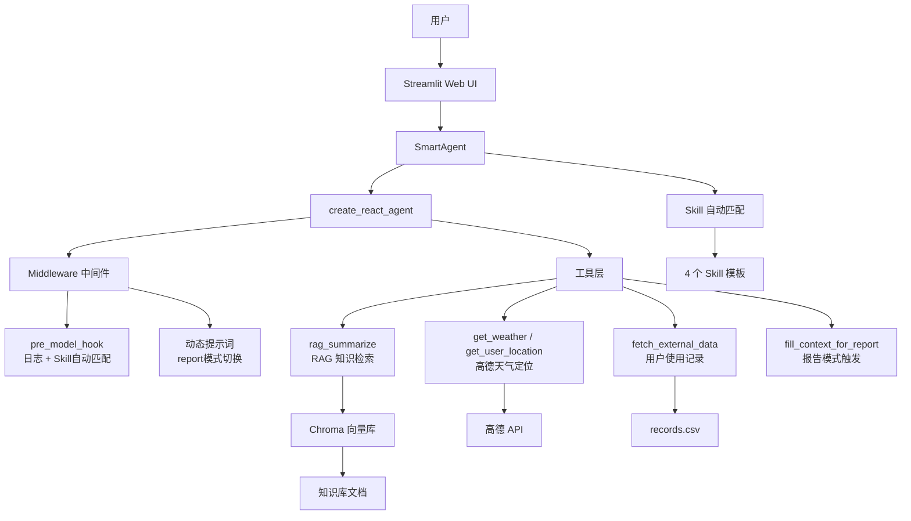

# 🤖 智扫通 — 扫地机器人智能客服

基于 **RAG + ReAct Agent** 架构的扫地/扫拖一体机器人智能客服系统。使用通义千问（DashScope）作为底层模型，结合 Chroma 向量知识库、工具调用与 Skill 模板，为用户提供产品咨询、故障排查、选购推荐、使用报告生成等服务。

## ✨ 核心特性

- **RAG 知识库问答**：基于 Chroma 向量数据库，从专业知识库中精准检索并生成回答
- **ReAct Agent**：基于 LangGraph `create_react_agent`，自动判断并调用合适的工具
- **Skill 自动匹配**：关键词匹配，4 个技能模板（故障排查、选购指南、配件推荐、报告生成）
- **MCP 工具扩展**：通过 MCP 协议接入高德地图（IP 定位 + 天气查询）
- **使用报告生成**：多步骤工具链（获取 ID → 月份 → 使用记录），生成结构化月度报告
- **中间件系统**：`pre_model_hook` 日志 + 自动 Skill 匹配、动态提示词切换、工具调用次数限制
- **流式输出**：Streamlit 流式输出，仅展示最终回答，隐藏中间思考过程
- **Docker 部署**：完整的 Docker 容器化支持

## 🏗️ 系统架构



## 📁 项目结构

```
smart_sweeper_agent/
├── app.py                       # Streamlit 入口
├── test_features.py             # 功能效果测试
├── verify_all.py                # 全功能验证
├── pyproject.toml               # 项目依赖与配置
├── Dockerfile / docker-compose.yml
├── agent/
│   ├── smart_agent.py           # SmartAgent 主类（MCP + Skill + 内置工具）
│   ├── react_agent.py           # ReactAgent（纯内置工具版）
│   ├── middleware.py             # 中间件：pre_model_hook、提示词构建、工具包装
│   └── tools/
│       └── agent_tools.py       # 7 个内置工具定义
├── config/
│   ├── agent.yml                # Agent 参数配置
│   ├── chroma.yml               # Chroma 向量库配置
│   ├── prompts.yml              # 提示词路径配置
│   └── rag.yml                  # RAG 模型配置
├── data/
│   ├── 扫地机器人100问2.txt      # 通用 FAQ
│   ├── 扫拖一体机器人100问.txt   # 扫拖一体 FAQ
│   ├── 故障排除.txt              # 故障排查知识库
│   ├── 维护保养.txt              # 维护保养知识库
│   ├── 选购指南.txt              # 选购知识库
│   └── external/
│       └── records.csv          # 用户月度使用记录
├── mcp_servers/
│   └── amap_server.py           # 高德地图 MCP Server
├── model/
│   └── factory.py               # 模型工厂（DashScope 对话/嵌入）
├── prompts/
│   ├── main_prompt.txt          # 主系统提示词
│   ├── rag_summarize.txt        # RAG 总结提示词
│   └── report_prompt.txt        # 报告生成提示词
├── rag/
│   ├── rag_service.py           # RAG 总结服务
│   └── vector_store.py          # Chroma 向量库服务
├── skills/
│   ├── troubleshooting.md       # 故障排查 Skill
│   ├── purchase_guide.md        # 选购指南 Skill
│   ├── accessory_recommend.md   # 配件推荐 Skill
│   └── report_generation.md     # 报告生成 Skill
├── utils/
│   ├── amap_client.py           # 高德 API 客户端
│   ├── config_handler.py        # 配置管理（Pydantic）
│   ├── file_handler.py          # 文件处理（TXT/PDF）
│   ├── logger_handler.py        # 日志处理
│   ├── path_tool.py             # 路径工具
│   ├── prompt_loader.py         # 提示词加载器
│   ├── skill_loader.py          # Skill 加载器（YAML frontmatter + 自动匹配）
│   └── tracing.py               # LangSmith 追踪
└── tests/
    ├── eval_dataset.yml          # 测评数据集
    ├── run_eval.py               # 测评脚本
    ├── conftest.py               # pytest 配置
    ├── test_amap_client.py       # 高德客户端测试
    ├── test_config_handler.py    # 配置管理测试
    ├── test_file_handler.py      # 文件处理测试
    ├── test_path_tool.py         # 路径工具测试
    └── test_rag_integration.py   # RAG 集成测试
```

## 🚀 快速开始

### 环境要求

- Python >= 3.11
- [uv](https://docs.astral.sh/uv/) 包管理器
- [DashScope API Key](https://dashscope.aliyun.com/)（通义千问）
- [高德地图 API Key](https://lbs.amap.com/)（可选，天气/定位）

### 本地运行

```bash
# 1. 克隆项目
git clone https://github.com/ShudiZhang/smart-sweeper-agent.git
cd smart_sweeper_agent

# 2. 安装依赖
uv sync

# 3. 配置环境变量
cp .env.example .env
# 编辑 .env，填入 DASHSCOPE_API_KEY

# 4. 启动应用
uv run streamlit run app.py
```

浏览器访问 `http://localhost:8501`。

### 安装 MCP 支持（可选）

```bash
uv sync --extra mcp
```

### Docker 部署

```bash
# 构建并启动
docker compose up -d

# 查看日志
docker compose logs -f

# 停止
docker compose down
```

### 环境变量

| 变量名 | 必填 | 说明 |
|--------|------|------|
| `DASHSCOPE_API_KEY` | ✅ | 阿里云 DashScope API Key |
| `AMAP_API_KEY` | ❌ | 高德地图 API Key（天气/定位功能需要） |
| `LANGCHAIN_API_KEY` | ❌ | LangSmith API Key（调试追踪） |

## 🔧 可用工具

Agent 内置以下工具，会自动根据用户问题选择合适的工具调用：

| 工具名 | 功能 | 入参 |
|--------|------|------|
| `rag_summarize` | 从向量知识库检索并总结 | `query: str` |
| `get_weather` | 查询指定城市实时天气 | `city: str` |
| `get_user_location` | IP 定位获取用户城市 | 无 |
| `get_user_id` | 获取当前用户 ID | 无 |
| `get_current_month` | 获取当前日期 | 无 |
| `fetch_external_data` | 获取用户使用记录 | `user_id`, `month` |
| `fill_context_for_report` | 触发报告场景上下文 | 无 |
| `amap_ip_location` | MCP：高德 IP 定位 | 无 |
| `amap_weather` | MCP：高德天气查询 | `city: str` |

## 🎯 Skill 模板

4 个 Skill 通过 YAML frontmatter 关键词自动匹配，也可在 Streamlit 侧边栏手动选择：

| Skill | 触发关键词 | 功能 |
|-------|-----------|------|
| `troubleshooting` | 坏了、故障、异响、不工作… | 故障诊断与排查 |
| `purchase_guide` | 推荐、选购、性价比、哪个好… | 选购建议与对比 |
| `accessory_recommend` | 配件、耗材、滤芯、边刷… | 配件更换推荐 |
| `report_generation` | 报告、使用记录、统计… | 生成月度使用报告 |

自定义 Skill 只需在 `skills/` 目录下添加 `.md` 文件，含 YAML frontmatter：

```yaml
---
name: my_skill
description: 我的自定义技能
triggers:
  keywords: ["关键词1", "关键词2"]
  priority: 8
---
# 技能正文...
```

## 🧪 测试与测评

```bash
# 全功能验证（不调 LLM，零成本）
uv run python verify_all.py

# 逐功能效果测试（调用 LLM）
uv run python test_features.py 1    # 故障排查
uv run python test_features.py 2    # 选购指南
uv run python test_features.py all  # 全部

# Skill 匹配准确率测评
uv run python tests/run_eval.py --quick

# 完整测评（Skill + 工具调用）
uv run python tests/run_eval.py --full --limit 5

# 单元测试
uv sync --dev
uv run pytest
uv run pytest --cov=. --cov-report=term
```

## 📄 License

MIT License
